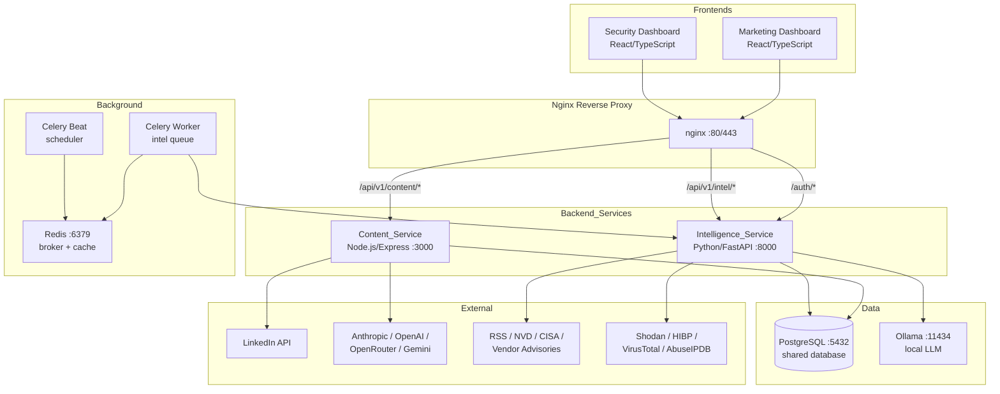

# Design Document: Unified Multimedia Platform

## Overview

The Unified Multimedia Platform consolidates two existing projects — Zero Day Radar (Python/FastAPI threat intelligence hunter) and OpenOSINT (Python/FastAPI OSINT platform with Node.js/Express marketing module) — into a single cohesive system. The architecture preserves the proven intelligence pipeline and scoring logic from Zero Day Radar while integrating the multi-provider content generation from OpenOSINT's marketing module.

### Key Design Decisions

1. **Two-service backend**: Intelligence_Service (Python/FastAPI) handles all threat intel collection, scoring, enrichment, and OSINT tools. Content_Service (Node.js/Express) handles AI-assisted content generation, campaign management, and social publishing. This preserves the language-native strengths of each domain.

2. **Shared PostgreSQL database**: Both services connect to the same PostgreSQL instance. Intelligence_Service owns the intel tables (write); Content_Service reads intel and owns content/asset tables (write). This eliminates data synchronization issues.

3. **Existing code preservation**: Zero Day Radar's collector framework, SAINT scoring engines, Ollama enrichment pipeline, and LinkedIn OAuth flow are migrated largely intact. OpenOSINT's marketing agents (email, hyperframe, remotion, slack/teams) are preserved within Content_Service.

4. **Human-in-the-loop as first-class concept**: All AI-generated content passes through an Approval_Queue before publication. The existing `human_verified` flag pattern from Zero Day Radar's LinkedIn posting is extended to all content types.

5. **Role separation at API level**: JWT tokens carry role claims. Each service validates role before processing. No shared admin role — operators configure via environment and CLI.

## Architecture



### Service Boundaries

| Concern | Owner | Notes |
|---------|-------|-------|
| Authentication & RBAC | Intelligence_Service | Issues JWT, validates roles |
| Intelligence collection | Intelligence_Service + Celery | All collectors run here |
| SAINT scoring & classification | Intelligence_Service | Threat + compliance engines |
| LLM enrichment (Ollama) | Intelligence_Service | Entity extraction during pipeline |
| OSINT investigation tools | Intelligence_Service | 23 tools from OpenOSINT |
| Content generation (AI) | Content_Service | Multi-provider LLM calls |
| Campaign management | Content_Service | Email, subscriber lists |
| Visual/video generation | Content_Service | HyperFrame, Remotion |
| Social media publishing | Content_Service | LinkedIn OAuth + Share API |
| Approval workflow | Content_Service | Queue, review, approve/reject |
| Slack/Teams alerts | Content_Service | Block Kit, Adaptive Cards |
| Background scheduling | Celery Beat + Worker | Collection every 20 min |

## Components and Interfaces

### Intelligence_Service (Python/FastAPI)

**Base URL**: `/api/v1/intel`

#### Authentication Endpoints

| Method | Path | Description | Auth |
|--------|------|-------------|------|
| POST | `/auth/register` | Create user account with role | None |
| POST | `/auth/login` | Issue JWT access + refresh tokens | None |
| POST | `/auth/refresh` | Refresh access token | Refresh token |
| GET | `/auth/me` | Current user profile | Any role |

#### Intelligence Endpoints

| Method | Path | Description | Auth |
|--------|------|-------------|------|
| GET | `/api/v1/intel/unified` | List unified intel (paginated, filterable) | security_team |
| GET | `/api/v1/intel/unified/{id}` | Get unified intel detail with score breakdown | security_team |
| POST | `/api/v1/intel/unified/run` | Trigger full pipeline manually | security_team |
| GET | `/api/v1/intel/unified/status` | Pipeline status + Ollama connectivity | security_team |
| GET | `/api/v1/intel/advisories` | List vendor advisories | security_team |
| GET | `/api/v1/intel/blogs` | List research blog intel | security_team |
| GET | `/api/v1/intel/breaches` | List company breach intel | security_team |
| GET | `/api/v1/intel/compliance` | List compliance intel | security_team |
| GET | `/api/v1/intel/social` | List social intel posts | security_team |
| GET | `/api/v1/intel/vulnerabilities` | List vulnerability intel | security_team |
| GET | `/api/v1/intel/feed` | Combined feed for marketing (read-only) | marketing_team |
| PATCH | `/api/v1/intel/unified/{id}/used` | Mark item as used in marketing | marketing_team |

#### Collector Management Endpoints

| Method | Path | Description | Auth |
|--------|------|-------------|------|
| GET | `/api/v1/intel/collectors` | List configured collectors + status | security_team |
| PATCH | `/api/v1/intel/collectors/{id}` | Enable/disable a collector | security_team |
| GET | `/api/v1/intel/jobs` | List background job statuses | security_team |
| POST | `/api/v1/intel/jobs/{task}/run` | Trigger manual collection run | security_team |

#### OSINT Tool Endpoints

| Method | Path | Description | Auth |
|--------|------|-------------|------|
| POST | `/api/v1/intel/osint/company-scan` | Run company OSINT scan | security_team |
| POST | `/api/v1/intel/osint/employee-leak` | Run employee breach lookup | security_team |
| POST | `/api/v1/intel/osint/infra-recon` | Run infrastructure recon | security_team |
| GET | `/api/v1/intel/osint/results/{scan_id}` | Get scan results | security_team |

### Content_Service (Node.js/Express)

**Base URL**: `/api/v1/content`

#### Content Generation Endpoints

| Method | Path | Description | Auth |
|--------|------|-------------|------|
| POST | `/api/v1/content/campaigns/generate` | Generate email campaign from intel | marketing_team |
| GET | `/api/v1/content/campaigns` | List all campaigns | marketing_team |
| POST | `/api/v1/content/campaigns/{id}/send` | Send approved campaign | marketing_team |
| POST | `/api/v1/content/hyperframe/generate` | Generate HyperFrame visual spec | marketing_team |
| POST | `/api/v1/content/hyperframe/{id}/render` | Render PNG from spec | marketing_team |
| POST | `/api/v1/content/video/generate` | Generate Remotion video spec | marketing_team |
| POST | `/api/v1/content/video/{id}/render` | Render MP4 from spec | marketing_team |
| POST | `/api/v1/content/comms/slack` | Generate Slack Block Kit message | marketing_team |
| POST | `/api/v1/content/comms/teams` | Generate Teams message card | marketing_team |

#### LinkedIn Endpoints

| Method | Path | Description | Auth |
|--------|------|-------------|------|
| GET | `/api/v1/content/linkedin/status` | Connection status | marketing_team |
| GET | `/api/v1/content/linkedin/preview/{intel_id}` | Preview post with media | marketing_team |
| POST | `/api/v1/content/linkedin/post` | Publish approved post | marketing_team |
| GET | `/auth/linkedin/login` | Initiate OAuth flow | marketing_team |
| GET | `/auth/linkedin/callback` | OAuth callback handler | None |
| POST | `/api/v1/content/linkedin/disconnect` | Remove OAuth tokens | marketing_team |

#### Approval Queue Endpoints

| Method | Path | Description | Auth |
|--------|------|-------------|------|
| GET | `/api/v1/content/approval-queue` | List pending assets | marketing_team |
| GET | `/api/v1/content/approval-queue/{id}` | Get asset detail + preview | marketing_team |
| POST | `/api/v1/content/approval-queue/{id}/approve` | Approve asset | marketing_team |
| POST | `/api/v1/content/approval-queue/{id}/reject` | Reject asset with notes | marketing_team |
| PATCH | `/api/v1/content/approval-queue/{id}/edit` | Edit before approval | marketing_team |

#### Subscriber & Asset Endpoints

| Method | Path | Description | Auth |
|--------|------|-------------|------|
| GET | `/api/v1/content/subscribers` | List subscribers | marketing_team |
| POST | `/api/v1/content/subscribers` | Add subscriber | marketing_team |
| DELETE | `/api/v1/content/subscribers/{id}` | Remove subscriber | marketing_team |
| GET | `/api/v1/content/assets` | List generated assets (gallery) | marketing_team |
| GET | `/api/v1/content/assets/{id}/download` | Download asset file | marketing_team |

### Inter-Service Communication

Content_Service reads intelligence data by querying PostgreSQL directly (read-only access to intel tables). When content is generated from an Intel_Item, Content_Service calls Intelligence_Service's internal endpoint to mark the item as used:

```
PATCH /api/v1/intel/unified/{id}/used
Authorization: Bearer <service-to-service-token>
```

This uses a service account JWT with a `service` role that has narrow write permissions.

## Data Models

### PostgreSQL Schema

```mermaid
erDiagram
    users {
        uuid id PK
        string email UK
        string password_hash
        string role "security_team | marketing_team"
        string display_name
        timestamp created_at
        timestamp updated_at
    }

    unified_intel {
        uuid id PK
        string company_name
        string vendor_name
        string product_name
        string version_name
        timestamp latest_date
        text title
        text summary
        jsonb cves
        jsonb frameworks
        float threat_score
        float compliance_score
        float confidence_score
        string risk_level
        string classification
        float classification_confidence
        text classification_reason
        jsonb score_breakdown
        text score_reason
        int source_count
        jsonb source_refs
        text llm_summary
        string llm_model
        boolean llm_enriched
        boolean used_in_marketing
        timestamp used_at
        string cluster_key UK
        timestamp created_at
        timestamp updated_at
    }

    intel_posts {
        uuid id PK
        string platform
        string source_id
        string source_name
        text title
        text content
        text url
        string author
        timestamp published_at
        jsonb matched_vendors
        jsonb cves
        float confidence_score
        string risk_level
        string content_hash UK
        timestamp created_at
    }

    vendor_advisory_intel {
        uuid id PK
        string source_id
        string vendor
        text title
        text content
        jsonb cves
        float confidence_score
        string risk_level
        string content_hash UK
        timestamp created_at
    }

    vulnerability_intel {
        uuid id PK
        string source_id
        string cve_id
        float cvss_score
        boolean in_cisa_kev
        boolean has_poc
        boolean has_exploit
        float confidence_score
        string content_hash UK
        timestamp created_at
    }

    compliance_intel {
        uuid id PK
        string source_id
        string organization
        jsonb frameworks
        float confidence_score
        string content_hash UK
        timestamp created_at
    }

    company_breach_intel {
        uuid id PK
        string source_id
        string affected_company
        string breach_type
        boolean is_ransomware
        float confidence_score
        string content_hash UK
        timestamp created_at
    }

    research_blog_intel {
        uuid id PK
        string source_id
        string source_name
        text title
        jsonb cves
        float confidence_score
        string content_hash UK
        timestamp created_at
    }

    content_assets {
        uuid id PK
        string asset_type "email | hyperframe | video | linkedin_post | slack_msg | teams_msg"
        uuid intel_id FK
        string status "pending_review | approved | rejected | published"
        jsonb ai_generated_content
        jsonb human_edited_content
        text reviewer_notes
        uuid reviewed_by FK
        timestamp reviewed_at
        string file_path
        string mime_type
        timestamp created_at
        timestamp updated_at
    }

    campaigns {
        uuid id PK
        uuid asset_id FK
        uuid intel_id FK
        string intel_title
        jsonb campaign_data
        jsonb recipients
        string status "draft | approved | sent"
        timestamp sent_at
        jsonb email_delivery
        timestamp created_at
    }

    subscribers {
        uuid id PK
        string email UK
        string name
        string company
        boolean active
        timestamp created_at
    }

    linkedin_oauth_tokens {
        uuid id PK
        string member_sub
        string member_urn
        string display_name
        text access_token
        text refresh_token
        timestamp expires_at
        string scopes
        timestamp created_at
        timestamp updated_at
    }

    approval_queue_history {
        uuid id PK
        uuid asset_id FK
        string action "submitted | approved | rejected | edited"
        uuid actor_id FK
        text notes
        timestamp created_at
    }

    osint_scan_results {
        uuid id PK
        string scan_type "company | employee | infra"
        jsonb query_params
        jsonb results
        float threat_score
        uuid initiated_by FK
        timestamp created_at
    }

    job_runs {
        uuid id PK
        string task_name
        string status "running | completed | failed"
        int retry_count
        text error_message
        timestamp started_at
        timestamp completed_at
        timestamp next_run_at
    }

    content_assets ||--o{ campaigns : "generates"
    unified_intel ||--o{ content_assets : "source for"
    users ||--o{ content_assets : "reviews"
    content_assets ||--o{ approval_queue_history : "tracks"
    users ||--o{ approval_queue_history : "acts on"
    users ||--o{ osint_scan_results : "initiates"
```



### Key Schema Notes

- **Intel tables** (intel_posts, vendor_advisory_intel, vulnerability_intel, etc.) retain the same structure from Zero Day Radar, migrated from SQLite to PostgreSQL with `jsonb` replacing JSON-in-text columns.
- **unified_intel** adds `used_in_marketing` and `used_at` columns to track marketing consumption.
- **content_assets** is the central content table. Every generated artifact gets a row here before entering the approval queue. Stores both AI-generated and human-edited versions.
- **approval_queue_history** provides an audit trail of all review actions.
- **job_runs** tracks Celery task execution for dashboard display.

### Authentication Token Structure (JWT)

```json
{
  "sub": "user-uuid",
  "email": "user@example.com",
  "role": "security_team",
  "iat": 1700000000,
  "exp": 1700003600
}
```

Access tokens expire in 1 hour. Refresh tokens expire in 7 days. Intelligence_Service issues tokens; Content_Service validates them using a shared JWT secret.

## Correctness Properties

*A property is a characteristic or behavior that should hold true across all valid executions of a system — essentially, a formal statement about what the system should do. Properties serve as the bridge between human-readable specifications and machine-verifiable correctness guarantees.*

### Property 1: SAINT threat score bounded output

*For any* set of intelligence signals forming a cluster (regardless of source count, CVE presence, PoC availability, or exploitation status), the SAINT_Engine SHALL produce a threat confidence score in the range [0, 100] inclusive.

**Validates: Requirements 3.1**

### Property 2: SAINT compliance score bounded output

*For any* set of compliance-related signals forming a cluster (regardless of framework identification, source authority, or update significance), the SAINT_Engine SHALL produce a compliance score in the range [0, 100] inclusive.

**Validates: Requirements 3.2**

### Property 3: Classification exhaustiveness

*For any* unified intel record processed by the SAINT classifier, the classification field SHALL be exactly one of PRODUCT_VULNERABILITY, COMPANY_BREACH, or UNKNOWN.

**Validates: Requirements 3.3**

### Property 4: Critical risk level threshold

*For any* unified intel cluster with signals from three or more independent sources where active exploitation is confirmed, the assigned risk level SHALL be CRITICAL.

**Validates: Requirements 3.4**

### Property 5: Signal grouping determinism

*For any* set of collected signals, grouping by (vendor, product, version, CVE) SHALL produce the same cluster assignments regardless of signal processing order.

**Validates: Requirements 3.5**

### Property 6: Content generation always produces approval queue entry

*For any* content generation request (email, hyperframe, video, LinkedIn post, Slack, or Teams message), the Content_Service SHALL create exactly one content_asset record with status PENDING_REVIEW before returning a response.

**Validates: Requirements 7.1**

### Property 7: Human verification gate for LinkedIn publishing

*For any* LinkedIn post request, if human_verified is not true, the request SHALL be rejected with an error and no post SHALL be published to LinkedIn.

**Validates: Requirements 7.5, 9.3**

### Property 8: Role-based access denial

*For any* API request, if the authenticated user's role does not match the required role for the endpoint, the system SHALL return an authorization error and no state mutation SHALL occur.

**Validates: Requirements 10.4, 10.5**

### Property 9: Content asset state machine validity

*For any* content_asset, the status transitions SHALL only follow valid paths: PENDING_REVIEW → APPROVED, PENDING_REVIEW → REJECTED, APPROVED → PUBLISHED. No other transitions are permitted.

**Validates: Requirements 7.3, 7.4**

### Property 10: LLM fallback determinism

*For any* content generation request where the configured LLM_Provider is unavailable, the Content_Service SHALL produce a valid content asset using deterministic fallback templates (no null or empty output).

**Validates: Requirements 8.5**

### Property 11: CVE deduplication idempotence

*For any* collection cycle that fetches NVD and CISA KEV entries, storing the same CVE identifier multiple times SHALL result in exactly one record per CVE in the vulnerability_intel table.

**Validates: Requirements 2.6**

### Property 12: Collection cycle fault tolerance

*For any* collection cycle, if N out of M collectors fail, the remaining (M - N) collectors SHALL complete successfully and store their results, and the pipeline SHALL not abort.

**Validates: Requirements 2.5**

### Property 13: Approval edit preserves original

*For any* content asset that is edited before approval, the system SHALL retain both the original AI-generated content and the human-edited version as separate fields.

**Validates: Requirements 7.6**

### Property 14: Migration timestamp preservation

*For any* record imported by a migration utility, the original created_at and source attribution fields SHALL be preserved unchanged in the destination database.

**Validates: Requirements 14.4**

## Error Handling

### Intelligence_Service Errors

| Scenario | Behavior | HTTP Status |
|----------|----------|-------------|
| Collector source unreachable | Log warning, skip source, continue cycle | N/A (background) |
| Ollama unavailable | Proceed with rule-based extraction, skip LLM enrichment | 200 (degraded) |
| Invalid JWT | Return 401 Unauthorized | 401 |
| Wrong role for endpoint | Return 403 Forbidden | 403 |
| Intel item not found | Return 404 Not Found | 404 |
| Pipeline execution error | Return 500 with error detail, log stack trace | 500 |
| Background job failure | Retry up to 3x with exponential backoff, then mark failed | N/A (logged) |
| Database connection lost | Connection pool retry, circuit breaker after 5 failures | 503 |

### Content_Service Errors

| Scenario | Behavior | HTTP Status |
|----------|----------|-------------|
| LLM provider unavailable | Use deterministic fallback template, return valid content | 200 (degraded) |
| human_verified not true | Reject with descriptive error | 400 |
| LinkedIn token expired | Return 401 with re-auth URL | 401 |
| LinkedIn not connected | Return 401 with login URL | 401 |
| Asset not found | Return 404 | 404 |
| Invalid asset state transition | Return 409 Conflict with current state | 409 |
| Remotion render failure | Return 503 with retry guidance | 503 |
| Email delivery failure (Resend) | Mark campaign as delivery_failed, return partial success | 200 |

### Background Job Error Strategy

```
Retry Policy:
  max_retries: 3
  backoff: exponential (30s, 120s, 480s)
  on_final_failure: mark job_runs.status = 'failed', log full stack trace
  alerting: if task_name in critical_tasks, generate alert notification
```

## Testing Strategy

### Property-Based Testing (PBT)

The SAINT scoring engines, classification logic, approval state machine, and role-based access control are pure-function or deterministic-state domains well suited to property-based testing.

**Library**: Hypothesis (Python) for Intelligence_Service, fast-check (TypeScript) for Content_Service

**Configuration**:
- Minimum 100 iterations per property test
- Each test tagged with: `Feature: unified-multimedia-platform, Property {N}: {title}`

**PBT Focus Areas**:
- SAINT threat scoring: generate random cluster inputs (0-20 sources, various boolean flags), verify score ∈ [0, 100]
- SAINT compliance scoring: generate random compliance clusters, verify score ∈ [0, 100]
- Classification: generate random records with varying fields, verify output ∈ {PRODUCT_VULNERABILITY, COMPANY_BREACH, UNKNOWN}
- Critical threshold: generate clusters with ≥3 sources + active exploitation, verify risk_level = CRITICAL
- Content asset state machine: generate random transition sequences, verify only valid transitions succeed
- Role enforcement: generate random (user_role, endpoint_role) pairs, verify deny when mismatched
- Fallback templates: generate random intel items with LLM disabled, verify non-null valid output
- Deduplication: generate random CVE lists with duplicates, verify unique storage

### Unit Testing

- Collector parsing logic (RSS, HTML scraping, JSON feeds)
- LLM prompt construction and response parsing
- JWT token generation and validation
- HyperFrame content normalization
- Email campaign sanitization (XSS prevention)
- LinkedIn post preview rendering
- Migration record transformation

### Integration Testing

- End-to-end pipeline: trigger collection → verify unified_intel rows created
- Content generation flow: request email → verify approval queue entry → approve → verify publish enabled
- LinkedIn OAuth flow: mock OAuth provider → verify token storage
- Inter-service communication: Content_Service marks intel as used → verify Intelligence_Service reflects change
- Background job lifecycle: enqueue task → verify execution → verify job_runs record

### End-to-End Testing

- Security analyst workflow: login → view feed → filter → drill down → trigger manual collection
- Marketing workflow: login → browse intel queue → generate campaign → review in approval queue → approve → publish
- Cross-service flow: security collects intel → marketing generates content → approves → publishes to LinkedIn
